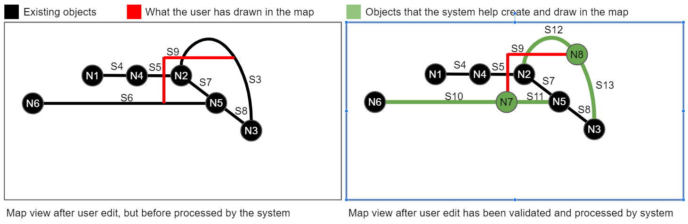

Route Network Editing Commands and Events (Happy Paths)
==============================


Use Case 1: New lonely route segment digitized by user
-------------------
The user draws a new route segment in the map, that don’t start or end at any existing route nodes or crosses any existing route segments


Now, because the route network is mapped to a graph (vertices and edges), the system must help the user create eventually missing nodes.

In this case, both ends of the drawn route segment is not snapped to any existing route nodes, so two new route nodes must be added to the route network event topic before the route segment drawn by the user can be added.

**Events emitted to event.route-network topic:**

```yaml
{
  "EventType": "RouteNodeAdded",
  "EventId": "6f479ac9-bb93-4d88-af6c-4f3a7a5ccb02",
  "EventTs": "2020-06-28T10:53:01Z",
  "CmdType": "NewRouteSegmentDigitizedByUser",
  "CmdId": "C1",
  "NodeId": "N1",
  "Geometry": "[578800, 6179700]"
}
```

```yaml
{
  "EventType": "RouteNodeAdded",
  "EventId": "2559f041-14e7-4856-80f3-3b96e389e0e5",
  "EventTs": "2020-06-28T10:53:02Z",
  "CmdType": "NewRouteSegmentDigitizedByUser",
  "CmdId": "C1",
  "NodeId": "N2",
  "Geometry": "[578810,6179700]"
}
```

```yaml
{
  "EventType": "RouteSegmentAdded",
  "EventId": "957f670e-9213-4b17-aa8b-42bbddcabf68",
  "EventTs": "2020-06-28T10:53:03Z",
  "CmdType": "NewRouteSegmentDigitizedByUser",
  "CmdId": "C1",
  "SegmentId": "S1",
  "FromNodeId": "N1",
  "ToNodeId": "N2",
  "Geometry": "[[578800, 6179700],[578810,6179700]]"
}
```
The id's "C1", "N1", "N2" and "S1" will be uuid's in the real system. The shorthand id's are used to make the examples easier to follow.

Notice that the id: C1 is the same in all three events. This is important, so that route network event consumers know that the three events are the results of the "NewRouteSegmentDigitizedByUser" command with id C1. Especially when we get to splitting segments, this is very important information for some of the consumers.

Also notice from the events shown above, that the order is important.
A segment must never be added to the route network event topic, unless the from and to node exists in the topic beforehand.
This makes it easy for consumers to work with the events in the topic - i.e. a consumer that maintain a graph in a graph database.
Applying the events in the route network topic to a graph in order, and the graph is guaranteed to be valid.

If the edit command of the user cannot be translated into one or more route network events that individually can be applied to a graph with success, then the events must not be added to the topic!

Use Case 2: New route segment digitized from/to an existing node by user
-------------------
The user draws a new route segment where one end is snapped to an existing route node.


Again the system has to help the user, because graph-wise it's illegal to add an edge (mapped to route segment) without having two vertices (mapped to route nodes). So we need to add the missing node first.

**Events emitted to event.route-network topic:**

```yaml
{
  "EventType": "RouteNodeAdded",
  "EventId": "f4bffaf5-c772-4507-91ed-b3b80632aa71",
  "EventTs": "2020-06-28T10:54:01Z",
  "CmdType": "NewRouteSegmentDigitizedByUser",
  "CmdId": "C2",
  "NodeId": "N3",
  "Geometry": "[578820,6179690]"
}
```

```yaml
{
  "EventType": "RouteSegmentAdded",
  "EventId": "03de6f0d-6660-4a21-bb11-20c406a15c37",
  "EventTs": "2020-06-28T10:53:02Z",
  "CmdType": "NewRouteSegmentDigitizedByUser",
  "CmdId": "C2",
  "SegmentId": "S2",
  "FromNodeId": "N2",
  "ToNodeId": "N3",
  "Geometry": "[[578810,6179700],[578820,6179690]]"
}
```

Notice that the command type is the same as the previous use case, but the command id has changed.

In this example we can derive that the user has drawn a polyline starting at N2 and down to N3, because the from node of the new segment is pointing to N2. If the user had started drawing from where N3 is located and to up to N2, then the from and to node would have been swapped.


Use Case 3: New route segment digitized between two existing nodes
-------------------
The user draws a new route segment between two existing nodes.


Here the system don't have to add any additional objects.

**Events emitted to event.route-network topic:**

```yaml
{
  "EventType": "RouteSegmentAdded",
  "EventId": "3c80690f-6179-4e8e-b358-8faedd16f2e4",
  "EventTs": "2020-06-28T10:54:01Z",
  "CmdType": "NewRouteSegmentDigitizedByUser",
  "CmdId": "C3",
  "SegmentId": "S3",
  "FromNodeId": "N2",
  "ToNodeId": "N3",
  "Geometry": "[[578810,6179700], more intermediate coordinates,[578820,6179690]]"
}
```

Use Case 4: Existing route segment splitted by a new route node drawn by the user
-------------------
The user draws a new route node on top of an existing route segment.

Maybe the user want to register a well that has been etablized on some existing underground route due to a digging hazzard.


Here the system has to create two new route segments replacing the splitted route segment.

**Events emitted to event.route-network topic:**

```yaml
{
  "EventType": "RouteNodeAdded",
  "EventId": "ba5f596c-8642-4265-8138-858c034ce958",
  "EventTs": "2020-06-28T10:55:01Z",
  "CmdType": "ExistingRouteSegmentSplittedByUser",
  "CmdId": "C4",
  "NodeId": "N4",
  "Geometry": "[578805, 6179700]"
}
```

```yaml
{
  "EventType": "RouteSegmentAdded",
  "EventId": "5103eac7-5699-47f6-95e8-8b2d79b8a364",
  "EventTs": "2020-06-28T10:55:02Z",
  "CmdType": "ExistingRouteSegmentSplittedByUser",
  "CmdId": "C4",
  "SegmentId": "S4",
  "FromNodeId": "N1",
  "ToNodeId": "N4",
  "Geometry": "[[578800,6179700],[578805, 6179700]]"
}
```

```yaml
{
  "EventType": "RouteSegmentAdded",
  "EventId": "7be7098f-04fb-4728-a127-2801327567eb",
  "EventTs": "2020-06-28T10:55:03Z",
  "CmdType": "ExistingRouteSegmentSplittedByUser",
  "CmdId": "C4",
  "SegmentId": "S5",
  "FromNodeId": "N4",
  "ToNodeId": "N2",
  "Geometry": "[[578805,6179700],[578810, 6179700]]"
}
```

```yaml
{
  "EventType": "RouteSegmentRemoved",
  "EventId": "2e916489-f97e-4684-acfe-2b02af9ed988",
  "EventTs": "2020-06-28T10:55:04Z",
  "CmdType": "ExistingRouteSegmentSplittedByUser",
  "CmdId": "C4",
  "SegmentId": "S1",
  "ReplacedBySegments": ["S4, S5"]
}
```

Notice the order:

1. The new node is created
2. The two new segments replacing the old one is created
3. The old segment is removed

The order and the property: "ReplacedBySegments" is important, because it allows a consumer the might have relations to segment S1 to "clean up".

As an example, there could be conduits related to route segment S1 - i.e. running in an underground route from N1 to N2 - maintained in a separate graph.
A consumer dealing with such a conduit graph can then swap relations to S1 with relations to S3 and S4 pretty easily when it receives a RouteSegmentRemoved.

Use Case 5: Existing route segment split by one end belonging to a new segment drawn by the user
-------------------
The user draws a new segment having one end intersecting with an existing segment.
In practice the geographical editing would be set up to use snap, so that segment ends snaps to segment edges.

Regarding the the events we record, it's just a combination of use case 4 and 2: First, an existing route segment is split by a node (use case 4); then a new route segment is drawn to/from that node (use case 2). It's convenient for the user of the system that they can execute these two commands by just drawing one polyline in the map.

The reason it's preferable that this use case result in the same commands and events as produced by use case 4 and 2, is to avoid throwing too many different command and event types at the event consumers, which will just add more complexity to their implementation. The business logic of the consumers (i.e. some consumer verifying if any conduit or cable routes will be rendered invalid by route network editing) don't care if the user modified the route network using use case 4 following by use case 2, or this use case.


**Events emitted to event.route-network topic:**

The first command, that split segment S2:

```yaml
{
  "EventType": "RouteNodeAdded",
  "EventId": "0448e29d-1512-4547-bf4d-378cd0926fb4",
  "EventTs": "2020-07-11T16:07:01Z",
  "CmdType": "ExistingRouteSegmentSplittedByUser",
  "CmdId": "C5",
  "NodeId": "N5",
  "Geometry": "[578815, 6179695]"
}
```

```yaml
{
  "EventType": "RouteSegmentAdded",
  "EventId": "9ee44243-125f-4ef4-9c43-4cb2fb33cfc8",
  "EventTs": "2020-07-11T16:07:02Z",
  "CmdType": "ExistingRouteSegmentSplittedByUser",
  "CmdId": "C5",
  "SegmentId": "S7",
  "FromNodeId": "N5",
  "ToNodeId": "N4",
  "Geometry": "[[578810,6179700],[578815, 6179695]]"
}
```

```yaml
{
  "EventType": "RouteSegmentAdded",
  "EventId": "481fd31d-84d4-4a02-806b-fd3e50d8d339",
  "EventTs": "2020-07-11T16:07:03Z",
  "CmdType": "ExistingRouteSegmentSplittedByUser",
  "CmdId": "C5",
  "SegmentId": "S8",
  "FromNodeId": "N5",
  "ToNodeId": "N3",
  "Geometry": "[[578815, 6179695],[578820,6179690]]"
}
```

```yaml
{
  "EventType": "RouteSegmentRemoved",
  "EventId": "55b61a5b-fa86-4d12-9867-d7def873f959",
  "EventTs": "2020-07-11T16:07:04Z",
  "CmdType": "ExistingRouteSegmentSplittedByUser",
  "CmdId": "C5",
  "SegmentId": "S2",
  "ReplacedBySegments": ["S7, S8"]
}
```

The second command, that adds N6 and a segment to N5.

```yaml
{
  "EventType": "RouteNodeAdded",
  "EventId": "3bd0720a-6145-4303-8934-8ad6c644a4e4",
  "EventTs": "2020-07-11T16:07:05Z",
  "CmdType": "NewRouteSegmentDigitizedByUser",
  "CmdId": "C6",
  "NodeId": "N6",
  "Geometry": "[578790, 6179695]"
}
```

```yaml
{
  "EventType": "RouteSegmentAdded",
  "EventId": "18d1f079-be87-46ad-9fbb-112b7546509e",
  "EventTs": "2020-07-11T16:07:06Z",
  "CmdType": "NewRouteSegmentDigitizedByUser",
  "CmdId": "C6",
  "SegmentId": "S6",
  "FromNodeId": "N6",
  "ToNodeId": "N5",
  "Geometry": "[[578790, 6179695],[578815, 6179695]]"
}
```

Use Case 6: Existing route segment splitted by both end belonging to a new segment drawn by the user
-------------------
The user draws a new segment having both ends intersecting with an existing segment.


In this case the system will first do two split commands (same as use case 4) and lastly one add segment command.
Again to shield the event consumers for needing to know a lot of business rules.

**Events emitted to event.route-network topic:**

Events belonging to the first split command (that split segment S6):

```yaml
{
  "EventType": "RouteNodeAdded",
  "EventId": "0448e29d-1512-4547-bf4d-378cd0926fb4",
  "EventTs": "2020-07-13T10:15:01Z",
  "CmdType": "ExistingRouteSegmentSplittedByUser",
  "CmdId": "C7",
  "NodeId": "N7",
  "Geometry": "geojson..."
}
```

```yaml
{
  "EventType": "RouteSegmentAdded",
  "EventId": "9ee44243-125f-4ef4-9c43-4cb2fb33cfc8",
  "EventTs": "2020-07-13T10:15:02Z",
  "CmdType": "ExistingRouteSegmentSplittedByUser",
  "CmdId": "C7",
  "SegmentId": "S10",
  "FromNodeId": "N6",
  "ToNodeId": "N7",
  "Geometry": "geojson..."
}
```

```yaml
{
  "EventType": "RouteSegmentAdded",
  "EventId": "481fd31d-84d4-4a02-806b-fd3e50d8d339",
  "EventTs": "2020-07-13T10:15:03Z",
  "CmdType": "ExistingRouteSegmentSplittedByUser",
  "CmdId": "C7",
  "SegmentId": "S11",
  "FromNodeId": "N7",
  "ToNodeId": "N5",
  "Geometry": "geojson..."
}
```

```yaml
{
  "EventType": "RouteSegmentRemoved",
  "EventId": "55b61a5b-fa86-4d12-9867-d7def873f959",
  "EventTs": "2020-07-13T10:15:04Z",
  "CmdType": "ExistingRouteSegmentSplittedByUser",
  "CmdId": "C7",
  "SegmentId": "S6",
  "ReplacedBySegments": ["S10, S11"]
}
```

Events belonging to the second first split command (that split segment S11, that was created as part of the split command above):

```yaml
{
  "EventType": "RouteNodeAdded",
  "EventId": "0448e29d-1512-4547-bf4d-378cd0926fb4",
  "EventTs": "2020-07-13T10:15:05Z",
  "CmdType": "ExistingRouteSegmentSplittedByUser",
  "CmdId": "C8",
  "NodeId": "N8",
  "Geometry": "geojson..."
}
```

```yaml
{
  "EventType": "RouteSegmentAdded",
  "EventId": "9ee44243-125f-4ef4-9c43-4cb2fb33cfc8",
  "EventTs": "2020-07-13T10:15:06Z",
  "CmdType": "ExistingRouteSegmentSplittedByUser",
  "CmdId": "C8",
  "SegmentId": "S12",
  "FromNodeId": "N7",
  "ToNodeId": "N8",
  "Geometry": "geojson..."
}
```

```yaml
{
  "EventType": "RouteSegmentAdded",
  "EventId": "481fd31d-84d4-4a02-806b-fd3e50d8d339",
  "EventTs": "2020-07-13T10:15:07Z",
  "CmdType": "ExistingRouteSegmentSplittedByUser",
  "CmdId": "C8",
  "SegmentId": "S13",
  "FromNodeId": "N8",
  "ToNodeId": "N5",
  "Geometry": "geojson..."
}
```

```yaml
{
  "EventType": "RouteSegmentRemoved",
  "EventId": "55b61a5b-fa86-4d12-9867-d7def873f959",
  "EventTs": "2020-07-13T10:15:08Z",
  "CmdType": "ExistingRouteSegmentSplittedByUser",
  "CmdId": "C8",
  "SegmentId": "S11",
  "ReplacedBySegments": ["S12, S13"]
}
```

The last command, that adds S9.

```yaml
{
  "EventType": "RouteSegmentAdded",
  "EventId": "18d1f079-be87-46ad-9fbb-112b7546509e",
  "EventTs": "2020-07-13T10:15:09Z",
  "CmdType": "NewRouteSegmentDigitizedByUser",
  "CmdId": "C9",
  "SegmentId": "S9",
  "FromNodeId": "N7",
  "ToNodeId": "N8",
  "Geometry": "geojson..."
}
```

Use Case 7: Two existing route segments are splitted by ends belonging to a new segment drawn by the user
-------------------
The user draws a new segment having ends intersecting with two different existing segments.



Like in the previous case, the system should also do two split commands and one add segment command.

Notice that the segment drawn by the user is allowed to cross other segments, and that the system will do nothing about it (i.e. will not split the segments in these places).

In real life, it might be that S9 is a tunnel, and S5 and S3 are some normal routes running at street level. Since you would never be able to route a conduit or cable from S9 to S5 or S3 where they crosses, we don't want a node in the graph these places.


**Events emitted to event.route-network topic:**

Events belonging to the first split command (that split segment S6):

```yaml
{
  "EventType": "RouteNodeAdded",
  "EventId": "0448e29d-1512-4547-bf4d-378cd0926fb4",
  "EventTs": "2020-07-13T10:25:01Z",
  "CmdType": "ExistingRouteSegmentSplittedByUser",
  "CmdId": "C7",
  "NodeId": "N7",
  "Geometry": "geojson..."
}
```

```yaml
{
  "EventType": "RouteSegmentAdded",
  "EventId": "9ee44243-125f-4ef4-9c43-4cb2fb33cfc8",
  "EventTs": "2020-07-13T10:25:02Z",
  "CmdType": "ExistingRouteSegmentSplittedByUser",
  "CmdId": "C7",
  "SegmentId": "S10",
  "FromNodeId": "N6",
  "ToNodeId": "N7",
  "Geometry": "geojson..."
}
```

```yaml
{
  "EventType": "RouteSegmentAdded",
  "EventId": "481fd31d-84d4-4a02-806b-fd3e50d8d339",
  "EventTs": "2020-07-13T10:25:03Z",
  "CmdType": "ExistingRouteSegmentSplittedByUser",
  "CmdId": "C7",
  "SegmentId": "S11",
  "FromNodeId": "N7",
  "ToNodeId": "N5",
  "Geometry": "geojson..."
}
```

```yaml
{
  "EventType": "RouteSegmentRemoved",
  "EventId": "55b61a5b-fa86-4d12-9867-d7def873f959",
  "EventTs": "2020-07-13T10:25:04Z",
  "CmdType": "ExistingRouteSegmentSplittedByUser",
  "CmdId": "C7",
  "SegmentId": "S6",
  "ReplacedBySegments": ["S10, S11"]
}
```

Events belonging to the second first split command (that split segment S3):

```yaml
{
  "EventType": "RouteNodeAdded",
  "EventId": "0448e29d-1512-4547-bf4d-378cd0926fb4",
  "EventTs": "2020-07-13T10:25:05Z",
  "CmdType": "ExistingRouteSegmentSplittedByUser",
  "CmdId": "C8",
  "NodeId": "N8",
  "Geometry": "geojson..."
}
```

```yaml
{
  "EventType": "RouteSegmentAdded",
  "EventId": "9ee44243-125f-4ef4-9c43-4cb2fb33cfc8",
  "EventTs": "2020-07-13T10:25:06Z",
  "CmdType": "ExistingRouteSegmentSplittedByUser",
  "CmdId": "C8",
  "SegmentId": "S12",
  "FromNodeId": "N2",
  "ToNodeId": "N8",
  "Geometry": "geojson..."
}
```

```yaml
{
  "EventType": "RouteSegmentAdded",
  "EventId": "481fd31d-84d4-4a02-806b-fd3e50d8d339",
  "EventTs": "2020-07-13T10:25:07Z",
  "CmdType": "ExistingRouteSegmentSplittedByUser",
  "CmdId": "C8",
  "SegmentId": "S13",
  "FromNodeId": "N8",
  "ToNodeId": "N3",
  "Geometry": "geojson..."
}
```

```yaml
{
  "EventType": "RouteSegmentRemoved",
  "EventId": "55b61a5b-fa86-4d12-9867-d7def873f959",
  "EventTs": "2020-07-13T10:25:08Z",
  "CmdType": "ExistingRouteSegmentSplittedByUser",
  "CmdId": "C8",
  "SegmentId": "S3",
  "ReplacedBySegments": ["S12, S13"]
}
```

The last command, that adds S9.

```yaml
{
  "EventType": "RouteSegmentAdded",
  "EventId": "18d1f079-be87-46ad-9fbb-112b7546509e",
  "EventTs": "2020-07-13T10:25:09Z",
  "CmdType": "NewRouteSegmentDigitizedByUser",
  "CmdId": "C9",
  "SegmentId": "S9",
  "FromNodeId": "N7",
  "ToNodeId": "N8",
  "Geometry": "geojson..."
}
```

Use Case 8: Route segment deleted by user
-------------------
The user deletes a route segment in the map.


From a graph point of view, deleting a segment is always a legal operation.
However, the problem is that there might objects related to a route segment. 

As an example there might be a conduit running from N6 to N3 (parsing through S10, N7, S11, N5 and S8).
Deleting the route segment S10 would then destoy the integrity of the overall network model.

The way we deal with this is to just mark the segment for deletion. A coordinating service listen on the RouteSegmentMarkedForDeletion events and will make sure that all route network validation services are asked if it's okay to delete that segment. If all answer yes, a RouteSegmentDeleted is added to the events.route-network topic and the segment can be deleted for real. If one of the validation services says no, then we have a conflict that must be handled by a user. 
No RouteSegmentDeleted will be added to the events.route-network topic, so the route segment will still be there, so network model integrity is not broken.
How that conflict is reported to the user, and how they resolve it, is out of scope and of no interest to the route network editing functionality. 

In the map we can choose to not show the segements marked for deletion or make them gray.


